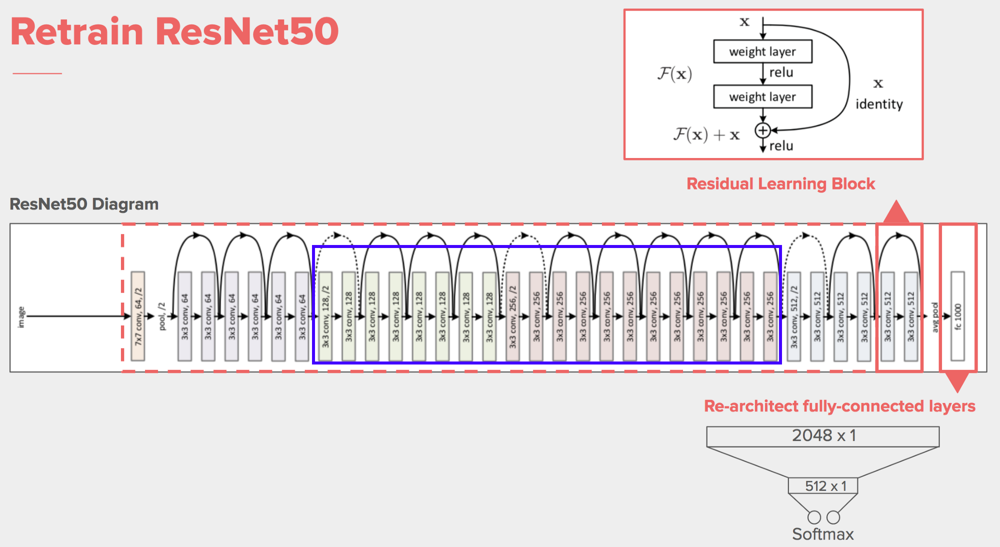

# Face-Recognition-using-OpenCV-and-CNN

# Project Overview
This project demonstrates a robust face recognition pipeline built using OpenCV for image capture and preprocessing, and a custom Convolutional Neural Network based on ResNet50 for classification. The system was trained on a dataset of 900 color face images collected from 9 individuals (100 images per person), achieving a remarkable 99.44% validation accuracy.

# CNN Architecture 

  

# ResNet50 Architecture 

  

# Key Features
Real-Time Face Detection using Haar Cascade Classifier (haarcascade_frontalface_default.xml).

Automated Dataset Generation with OpenCV via webcam.

Advanced Preprocessing Pipeline to improve image quality and consistency.

Custom ResNet50-based CNN Architecture built from scratch using TensorFlow/Keras.

Evaluation & Visualization: Assessed model with a confusion matrix and Classification Report

High Accuracy Performance on a relatively small and personalized dataset.

# Installation
Clone my repository:

https://github.com/Akhilesh-Banke/-Face-Recognition-using-OpenCV-and-CNN.git
